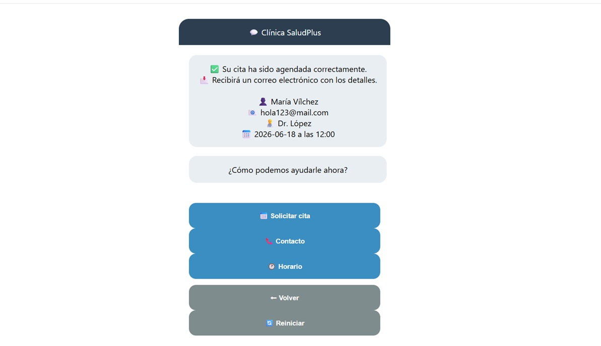
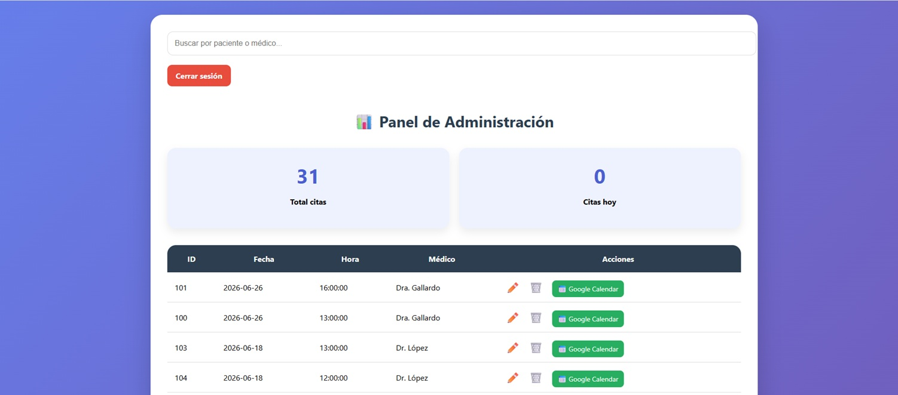
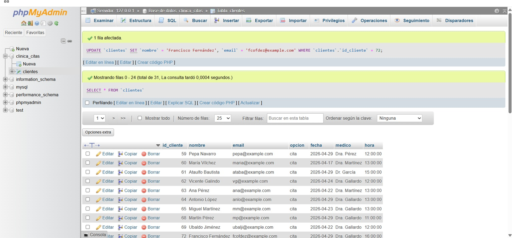

# 🏥 Chatbot Clínica SaludPlus

Sistema web para gestión de citas médicas desarrollado en PHP y MySQL.

Este proyecto permite a los usuarios solicitar citas médicas mediante una interfaz tipo chatbot, facilitando la gestión de pacientes, horarios y consultas de forma sencilla e intuitiva.

---

## 🚀 Funcionalidades

- Solicitud de citas médicas mediante chatbot.
- Registro automático de pacientes.
- Gestión de citas en base de datos MySQL.
- Confirmación de citas mediante correo electrónico.
- Consulta de horarios de atención.
- Información de contacto de la clínica.
- Panel de administración para gestionar citas.
- Integración con Google Calendar.
- Búsqueda de pacientes y citas.
- Interfaz responsive y fácil de usar.

---

## 🛠️ Tecnologías utilizadas

- PHP
- MySQL
- HTML5
- CSS3
- JavaScript
- PHPMailer
- XAMPP

---

## 📸 Capturas del proyecto

### Página principal


Interfaz inicial del chatbot con acceso a solicitud de citas, información de contacto y horarios.

---

### Solicitud de cita


Formulario conversacional donde el usuario introduce sus datos para reservar una cita médica.

---

### Confirmación de cita



Resumen final de la cita reservada y confirmación del envío por correo electrónico.

---

### Información de contacto


Pantalla con los datos de contacto de la clínica.

---

### Horario de atención


Consulta rápida de horarios disponibles.

---

### Panel de administración



Zona privada para la gestión de citas médicas, edición y eliminación de registros.

---

### Base de datos MySQL



Almacenamiento de pacientes y citas mediante MySQL.

---

## ⚙️ Instalación

### 1. Clonar repositorio

```bash
git clone https://github.com/DeliaGP22/Chatbot_Clinica_Saludplus.git
```

### 2. Copiar el proyecto

Mover la carpeta al directorio:

```text
C:\xampp\htdocs\
```

### 3. Importar la base de datos

Abrir phpMyAdmin e importar:

```text
clinica_citas.sql
```

### 4. Configurar conexión

Editar:

```text
config/conexion.php
```

y establecer los parámetros de conexión correspondientes.

### 5. Configurar correo electrónico

Editar:

```text
email.php
```

y añadir las credenciales SMTP necesarias para el envío de correos.

### 6. Ejecutar el proyecto

Iniciar Apache y MySQL desde XAMPP.

Acceder a:

```text
http://localhost/chatbot-clinica/
```

---

## 📚 Aprendizajes

Este proyecto fue desarrollado como práctica del ciclo de Desarrollo de Aplicaciones Multiplataforma (DAM), aplicando conocimientos de:

- Programación web con PHP.
- Bases de datos relacionales con MySQL.
- Gestión de formularios.
- Envío de correos electrónicos con PHPMailer.
- Diseño de interfaces web.
- Arquitectura básica cliente-servidor.

---

## 👩‍💻 Autora

**Delia Gallardo Pastor**

Desarrolladora de Aplicaciones Multiplataforma Junior.

- GitHub: https://github.com/DeliaGP22
- LinkedIn: https://www.linkedin.com/in/delia-gallardo-pastor-b3863a331/

